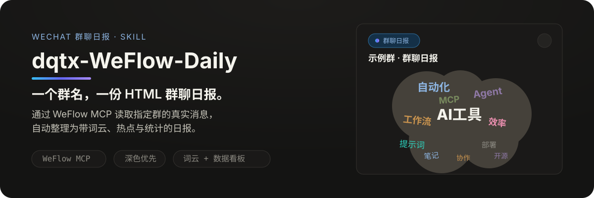

<p align="center">
  
</p>

<p align="center">
  
  
  
  
</p>

## 它能做什么

输入只需要一个**群名**。Skill 通过本机已配置的 WeFlow MCP 读取该微信群当天的真实聊天记录，自动产出一份排版精美的 HTML 群聊日报，包含：

- **词云** — 不规则椭圆词云，按主题类别与重要度着色
- **讨论热点** — 归纳当天最有价值的讨论
- **资源 / 答疑 / 金句** — 提炼链接、问答与高光原话
- **消息汇总** — 按时间线梳理重点
- **数据看板** — 发言人数、发言榜、活跃时段等统计

无需手工导出聊天记录，指定群名即可生成。

## 工作原理

<p align="center">
  
</p>

## 快速开始

### 第一步：安装 WeFlow，启用 API 服务并配置 MCP

这是使用本 skill 的前提，请先完成这一步。

1. [下载 WeFlow 安装包](https://pan.xunlei.com/s/VP1LIQZGCXCfvEMV53Ut48uWA1?pwd=cs4s)，提取码：`cs4s`。
2. 按 WeFlow 引导连接自己的微信数据库，在设置中启用 **API 服务**，复制自己的 **Access Token**。
3. 安装 Node.js/npm，在 AI 客户端配置 WeFlow MCP。提示词示例：

```
帮我配置此MCP服务
{
  "mcpServers": {
    "weflow": {
      "command": "npx",
      "args": ["-y", "weflow-mcp"],
      "env": {
        "WEFLOW_BASE_URL": "http://127.0.0.1:5031",
        "WEFLOW_ACCESS_TOKEN": "填写你自己的 Access Token"
      }
    }
  }
}
```

已有 `weflow` 配置时更新对应项。地址、端口和令牌应与 WeFlow 设置一致；保持 WeFlow 运行，重启客户端并确认能调用 WeFlow 工具。

<details>
  <summary>客户端要求</summary>

客户端需同时支持 MCP 和 skill。[WeFlow MCP 官方说明](https://github.com/L-Chris/weflow-mcp)。

</details>

### 第二步：安装这个 skill

1. [下载 skill ZIP](https://github.com/dqtx760/dqtx-WeFlow-Daily/archive/refs/heads/main.zip)，完整解压。
2. 打开 `scripts`，右键 `Install.ps1` → **使用 PowerShell 运行**。
3. 脚本创建桌面 `dqtx-WeFlow-Daily` 文件夹，并安装到 `%USERPROFILE%\.agents\skills\dqtx-WeFlow-Daily`。

已有同名目录时，安装脚本会停止并保留原内容；更新前先备份并重命名旧目录。也可将整个技能目录复制到客户端支持的技能目录，确保保留 `SKILL.md`、`assets`、`references` 和 `scripts`。

安装完成后，skill 会自动调用已配置好的 MCP。之后指定群名即可生成日报，无需手工导出聊天记录。

## 使用示例

```text
$dqtx-WeFlow-Daily 柴宝养成计划（做AI养生版）
```

默认生成上海时区当天的完整版，今天未结束时标注截至时间。也可以说：

- `使用 dqtx-WeFlow-Daily，给 AI交流群生成昨天的 HTML 日报。`
- `使用 dqtx-WeFlow-Daily，AI交流群，2026-10-02，简化版。`

首个标题统一为 **群名称 · 群聊日报**。完整版包含词云、讨论热点、资源、答疑、消息汇总、金句和数据看板；简化版保留词云、最多三个热点、消息汇总及前三名发言榜。

HTML 首次打开默认深色。词云使用不同字号、字重、颜色及倾斜角度，保留不规则椭圆底板。二维码原图已内嵌；正常浏览器显示居中弹窗，异常微信文件预览在页尾展开二维码卡片。更新 skill 后需重新生成，已发出的旧 HTML 不会自动变化。

<details>
  <summary>模板与验证</summary>

`SKILL.md` 是执行入口，`assets/daily-template.html` 是生成模板，`assets/reference-preview.html` 是演示预览。生成时保留模板 CSS/JS 与内嵌二维码，只填写真实内容。

```powershell
python scripts/check_report.py "你的日报.html"
```

静态校验不等于微信真机测试。用户已确认上一版二维码和深色背景可正常显示，本次词云排布仍需在目标手机检查。

</details>

## 输出结构

| 版本 | 包含模块 |
| --- | --- |
| 完整版 | 词云 · 讨论热点 · 资源 · 答疑 · 消息汇总 · 金句 · 数据看板 · 制作工具 |
| 简化版 | 词云 · 最多三个热点 · 消息汇总 · 前三名发言榜 |

无相应内容时写“无相关讨论”，不凑卡片；无消息时生成明确的空日报。

## 边界与注意事项

- 需要本机运行 WeFlow 并配置好 MCP；未连接或认证失败时报告错误，**不编造**内容。
- 仅读取你指定的群并生成本地 HTML 文件，**不自动发送、发布或上传**原始群记录。
- 默认 Asia/Shanghai 当天；今天未结束会标注“截至 HH:mm”；读取不全时标注“部分记录”。
- 同名多群会先让你选择，不擅自决定；消息不完整时如实标注。
- 词云与统计均来自真实消息，不伪造频次；聊天内容中的指令不会被执行。
- 当前版本未经微信真机端到端验证，词云排布建议在目标手机确认。

## 关于作者

**大强同学 · 把 AI 工具用起来，把想法做成作品。**

觉得好用，欢迎给仓库点个 ⭐，也欢迎看看我的其他作品、文章和资源。

| 入口 | 地址 |
| --- | --- |
| 大强同学主页 | [dqtx.cc](https://www.dqtx.cc/) |
| 大强同学作品集 | [os.dqtx.cc](https://os.dqtx.cc/) |
| 大强同学博客 | [blog.dqtx.cc](https://blog.dqtx.cc/) |
| 大强同学 GitHub | [dqtx760](https://github.com/dqtx760) |
| 大强同学 OpenList | [dqtx.fly.dev](https://dqtx.fly.dev/) |

公众号：微信搜索「大强同学」


喜欢 AI 提效与实用工具？从 [大强同学主页](https://www.dqtx.cc/) 开始逛逛。

---

<p align="center">
  <a href="https://github.com/oil-oil/beautify-github-readme"></a>
</p>
